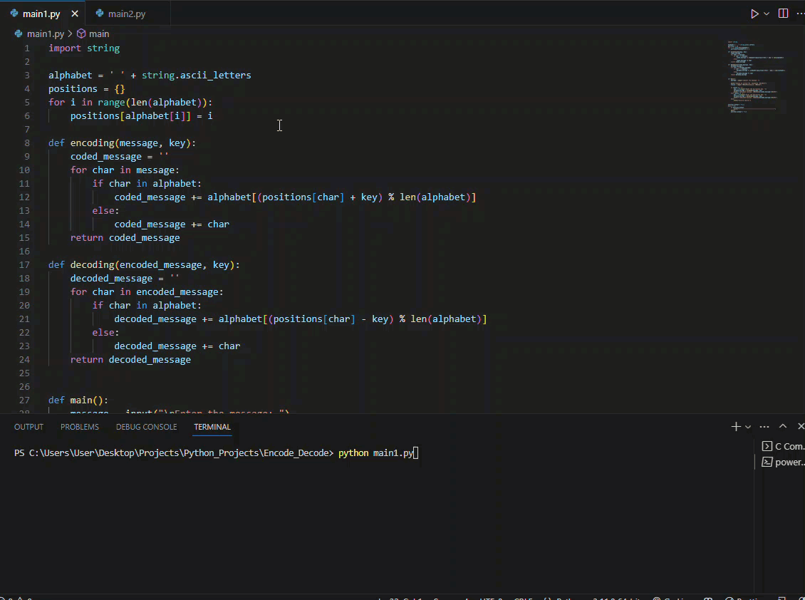
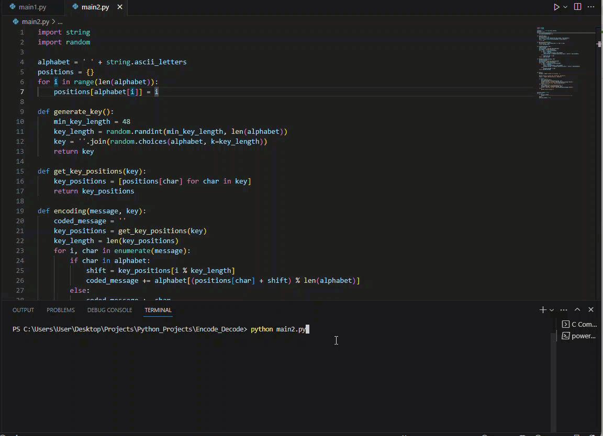

# Encode and Decode Messages

## Demo


## Description

### main1.py

This script allows you to encode and decode messages using the Caesar cipher. The user can input a message and choose between encoding or decoding. If encoding is selected, the user is prompted to enter an encryption key, and the encoded message is displayed. If decoding is selected, the user is prompted to enter a decryption key, and the decoded message is displayed.

To use `main1.py`, follow these steps:
1. Run the script.
2. Enter the message you want to encode or decode.
3. Choose an option by entering the corresponding number:
   - `1` for encoding
   - `2` for decoding
4. If encoding is selected:
   - Enter the encryption key (an integer).
   - The encoded message will be displayed.
5. If decoding is selected:
   - Enter the decryption key (an integer).
   - The decoded message will be displayed.


## Demo


### main2.py

This script allows you to encode and decode messages using a randomly generated encryption key. The user can input a message and choose between encoding or decoding. If encoding is selected, the script generates a random encryption key and displays both the encoded message and the encryption key. If decoding is selected, the user is prompted to enter the decryption key, and the decoded message is displayed.

To use `main2.py`, follow these steps:
1. Run the script.
2. Enter the message you want to encode or decode.
3. Choose an option by entering the corresponding number:
   - `1` for encoding
   - `2` for decoding
4. If encoding is selected:
   - A random encryption key will be generated.
   - The encoded message and the encryption key will be displayed.
5. If decoding is selected:
   - Enter the decryption key (a string).
   - The decoded message will be displayed.


## Usage

#
1. Clone the repository:

   ```bash
   git clone https://github.com/iAlex0/encode-and-decode-messages.git

#
2. Run server:

```bash
python main1.py || python main2.py
```


## License
MIT © iAlex0